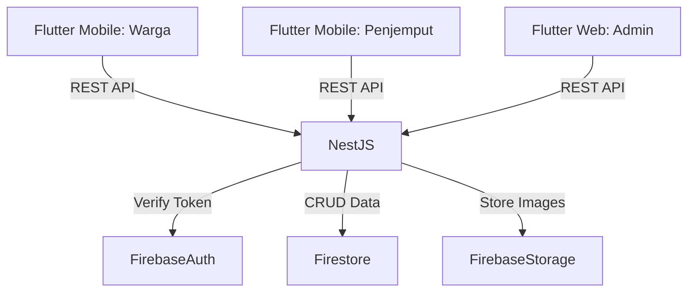

# Technical Specification: Circular Resilience App

## 1. Project Overview

Aplikasi ini bertujuan untuk menciptakan ekosistem pengelolaan sampah digital di pemukiman padat (slums). Sistem menghubungkan **Warga (Household)** dengan **Penjemput (Collector)** untuk menukarkan sampah menjadi insentif finansial, serta menyediakan dashboard monitoring yang komprehensif bagi **Admin**.

* **Platform:** Mobile App (Android/iOS) & Web Dashboard.
* **Tech Stack:**
* **Frontend:** Flutter (Mobile untuk Warga & Collector, Web untuk Admin).
* **Backend:** NestJS (REST API).
* **Database:** Google Firestore (NoSQL).
* **Auth:** Firebase Authentication.
* **Storage:** Firebase Storage (Foto sampah/bukti transaksi).


---

## 2. System Architecture

Sistem menggunakan arsitektur **Client-Server** dengan pola komunikasi RESTful API. NestJS bertindak sebagai *logic layer* untuk memastikan keamanan data saldo dan validasi transaksi, sementara Firebase menangani autentikasi dan penyimpanan data real-time.



---

## 3. Database Schema (Firestore)

Desain NoSQL diperbarui secara mendetail berdasarkan antarmuka pengguna (UI) untuk mendukung performa baca yang cepat dan *real-time updates*.

### A. Collection: `users`

Menyimpan data profil, saldo, dan statistik akumulatif per user.

**Document ID:** `uid` (dari Firebase Auth)

```json
{
  "uid": "string",
  "role": "household | collector | admin",
  "fullName": "string", // e.g., "Siti Nurhaliza", "Budi Santoso"
  "phoneNumber": "string",
  "address": {
    "street": "string", // e.g., "Jl. Merdeka No. 12"
    "rt_rw": "string",  // e.g., "RT 03/RW 05"
    "fullAddress": "string"
  },
  "coordinates": { "lat": double, "lng": double },
  "balance": number, // e.g., 125000 (disinkronkan dengan transaksi)
  "createdAt": timestamp,
  
  // Fields khusus Household (Warga)
  "householdStats": {
    "totalWasteAccumulated": number, // e.g., 47.5 (kg)
    "participationScore": number // Untuk metrik partisipasi
  },

  // Fields khusus Collector (Penjemput)
  "collectorStats": {
    "totalPickups": number, // e.g., 45
    "totalWeightCollected": number, // e.g., 312.5 (kg)
    "currentDayPickups": number, // Reset tiap 00:00 via cron job
    "currentDayWeight": number
  }
}

```

### B. Collection: `waste_types`

Master data harga sampah (Config).

**Document ID:** `waste_code` (e.g., `PLASTIK`, `KERTAS`)

```json
{
  "id": "string", 
  "name": "string", // e.g., "Plastik", "Kertas", "Campuran"
  "pricePerKg": number, // e.g., 3500
  "colorCode": "string", // Hex code untuk grafik (e.g., "#22C55E")
  "description": "string"
}

```

### C. Collection: `transactions`

Menyimpan riwayat transaksi lengkap (sumber data untuk History & Financial Monitoring).

**Document ID:** `transaction_uuid`

```json
{
  "transactionId": "string",
  "status": "PENDING | ASSIGNED | COMPLETED | CANCELLED",
  
  // Data Warga
  "householdId": "string (ref: users)",
  "householdName": "string", // Denormalisasi untuk UI Collector
  "pickupLocation": {
    "address": "string",
    "rt_rw": "string",
    "lat": double,
    "lng": double
  },

  // Data Penjemput
  "collectorId": "string (ref: users, nullable if PENDING)",
  "collectorName": "string",

  // Detail Sampah & Keuangan
  "wasteType": "string", // "Plastik", "Kertas", "Campuran"
  "weightKg": number, // e.g., 5.2
  "pricePerKgSnapshot": number, // Harga saat transaksi terjadi
  "totalAmount": number, // e.g., 18200
  
  // Timestamps
  "createdAt": timestamp, // Waktu request
  "assignedAt": timestamp, // Waktu collector ambil order
  "completedAt": timestamp, // Waktu penimbangan selesai (e.g., 2026-02-13)
  
  // Bukti
  "proofImageUrl": "string"
}

```

### D. Collection: `analytics_daily`

Agregasi harian untuk grafik *Admin Dashboard* (Bar Chart & Line Chart). Dokumen dibuat/diupdate via Cloud Functions/NestJS cron saat transaksi selesai.

**Document ID:** `YYYY-MM-DD` (e.g., `2026-02-14`)

```json
{
  "date": "string",
  "totalWeight": number, // Untuk "Tren Sampah Harian"
  "totalPayout": number, // Untuk "Tren Pembayaran Harian"
  "transactionCount": number,
  "wasteComposition": {
    "plastik": number, // weight
    "kertas": number,
    "campuran": number
  },
  "activeCollectors": number,
  "activeHouseholds": number
}

```

### E. Collection: `global_stats`

Dokumen tunggal untuk *Cards Overview* di Admin Dashboard (agar tidak perlu query sum semua transaksi).

**Document ID:** `summary`

```json
{
  "totalWasteAllTime": number, // e.g., 1247.5
  "totalPayoutAllTime": number, // e.g., 3450000
  "totalActiveUsers": number, // e.g., 342
  "totalActiveCollectors": number, // e.g., 28
  "averageWastePerUser": number, // e.g., 4.2
  "participationRate": number // e.g., 78 (persen)
}

```

---

## 4. Backend Specification (NestJS)

Backend berfungsi sebagai "Source of Truth" untuk kalkulasi dan update atomic.

### A. Authentication & Guards

* **AuthMiddleware:** Memvalidasi `Bearer Token` dari Firebase Auth.
* **RolesGuard:** Memastikan akses endpoint (e.g., hanya Collector bisa input berat).

### B. API Endpoints

#### **Module: Auth & User**

* `POST /auth/register`: Register user & set custom claims.
* `GET /users/dashboard/household`: Mengambil data untuk UI "Siti Nurhaliza" (Balance, Total Waste, Recent Transactions).
* `GET /users/dashboard/collector`: Mengambil data untuk UI "Budi Santoso" (Daily stats, Assigned pickups).

#### **Module: Transaction (Core Logic)**

* **Household:**
* `POST /transactions/request`: Input `wasteType`, `location`. Output: Transaction ID (Status: PENDING).


* **Collector:**
* `GET /transactions/nearby`: Query Firestore where `status == PENDING`.
* `PATCH /transactions/:id/claim`: Set `collectorId`, Status -> ASSIGNED.
* `POST /transactions/:id/complete`:
* **Input:** `weightKg`, `proofImage`.
* **Process:**
1. Ambil `pricePerKg` dari DB.
2. Hitung `totalAmount`.
3. **Atomic Transaction:**
* Update status `COMPLETED`.
* Increment `balance` & `householdStats.totalWasteAccumulated` (Household).
* Increment `collectorStats` (Collector).
* Update `analytics_daily` & `global_stats`.


#### **Module: Admin Analytics**

* `GET /admin/overview`: Mengambil data dari collection `global_stats`.
* `GET /admin/charts/daily`: Mengambil data range dari `analytics_daily` untuk Bar & Line charts.
* `GET /admin/financial-monitor`: List transaksi dengan pagination (filter: Completed).
* `GET /admin/performance/collectors`: Query `users` where `role == collector`, sort by `totalPickups`.

---

## 5. Frontend Specification (Flutter)

Satu codebase, dikompilasi menjadi Mobile (Android/iOS) dan Web.

### A. UI Implementation: Household (Mobile)

* **Home Dashboard:**
* *Header:* Greeting & Saldo Card (Gradient background).
* *Stats:* Chip "Total sampah: 47.5 kg".
* *Action:* Big Green Button "Setor Sampah".
* *List:* `ListView.builder` menampilkan transaksi terakhir. Gunakan warna hijau (`+Rp`) untuk visualisasi pemasukan.


* **Setor Flow:** Form sederhana dropdown jenis sampah & auto-detect lokasi.

### B. UI Implementation: Collector (Mobile)

* **Dashboard:**
* *Daily Stats:* Row widget menampilkan "Penjemputan Hari Ini" & "Berat Terkumpul".
* *Task List:* Card widget untuk tiap request. Tampilkan badge status "Pending" (Orange).
* *Detail Action:* Saat item diklik -> Buka halaman timbangan. Input berat -> Backend calculate price -> Show Confirmation.


### C. UI Implementation: Admin (Web)

* **Layout:** Sidebar Navigation (Overview, Analytics, Keuangan).
* **Overview Page:**
* *Cards:* 4 card statistik utama (Icon + Value + Label).
* *Charts:*
* `PieChart` (fl_chart) untuk Komposisi Sampah.
* Custom Paint / Map Widget untuk "Lokasi Penjemputan" (Heatmap visual).


* **Analytics Page:**
* *Charts:*
* `BarChart` untuk Tren Sampah Harian (Hijau).
* `LineChart` untuk Tren Pembayaran (Oranye, curved lines).


* *Table:* `DataTable` widget untuk "Performa Penjemput".


* **Financial Page:**
* `PaginatedDataTable` untuk monitoring mikro-pembayaran. Kolom: Tanggal, Jenis, Berat, Jumlah, Status (Badge Hijau "Selesai").


---

## 6. Key Libraries & Packages

| Kategori | Package Flutter | Kegunaan |
| --- | --- | --- |
| **Core** | `firebase_core`, `firebase_auth` | Koneksi Firebase & Login |
| **State Mgmt** | `flutter_bloc` | Manajemen state kompleks (Dashboard update) |
| **Data** | `cloud_firestore` | CRUD Database |
| **API** | `dio` | HTTP Client ke NestJS |
| **Maps** | `geolocator`, `Maps_flutter` | Lokasi & Heatmap Admin |
| **Charts** | `fl_chart` | Grafik Line, Bar, dan Pie di Admin |
| **UI Kit** | `google_fonts`, `lucide_icons` | Font & Icon set modern |
| **Utils** | `intl` | Format Currency (Rp) & Date |

---

## 7. Development Roadmap

1. **Phase 1: Foundation (Minggu 1)**
* Setup NestJS & Firebase.
* Implementasi Schema Firestore (Users, WasteTypes).
* Auth Flow (Login/Register).


2. **Phase 2: Core Loop (Minggu 2)**
* Household: Request Pickup UI & API.
* Collector: List Pending & Input Weight UI.
* Backend: Logic kalkulasi harga & Atomic update saldo.


3. **Phase 3: Real-time & Data (Minggu 3)**
* Implementasi `analytics_daily` trigger di backend.
* Integrasi `transactions` history di Household UI.


4. **Phase 4: Admin Dashboard (Minggu 4)**
* Integrasi `fl_chart` untuk visualisasi data.
* Tabel monitoring keuangan.
* Final Polish & Testing.